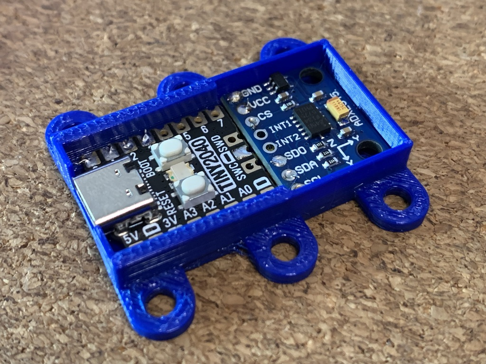

# openscad-pico-adxl345

A simple snap-on case for an RP2040-based accelerometer module for Klipper, using an `ADXL345` and a Pimoroni Tiny 2040.



## Configuration Notes

This was first outlined [in this Klipper forum post](https://klipper.discourse.group/t/raspberry-pi-pico-adxl345-portable-resonance-measurement/1757).

```bash
cd ~/klipper/
make menuconfig # select RP2040 as target
make
# Connect the Pico via USB while holding down BOOT
sudo mount /dev/sda1 /mnt
sudo cp out/klipper.uf2 /mnt
sudo umount /mnt
# This should trigger a reboot and you should see a new serial port
ls -al /dev/serial/by-id/*
```

Add this configuration to your `printer.cfg` (I use an `include` directive)

```ini
[mcu pico]
serial: /dev/serial/by-id/usb-Klipper_rp2040_mySerial

[adxl345]
spi_bus: spi0a
cs_pin: pico:gpio1

[resonance_tester]
accel_chip: adxl345
probe_points:
    100,100,20 # an example
```
The models include a little soldering jig to hold both boards together in approximately the same position as the case.